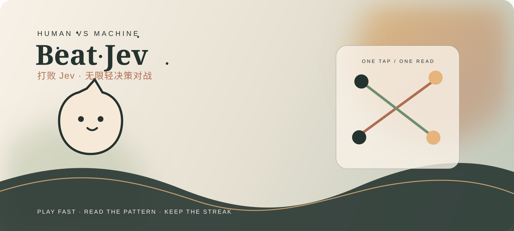
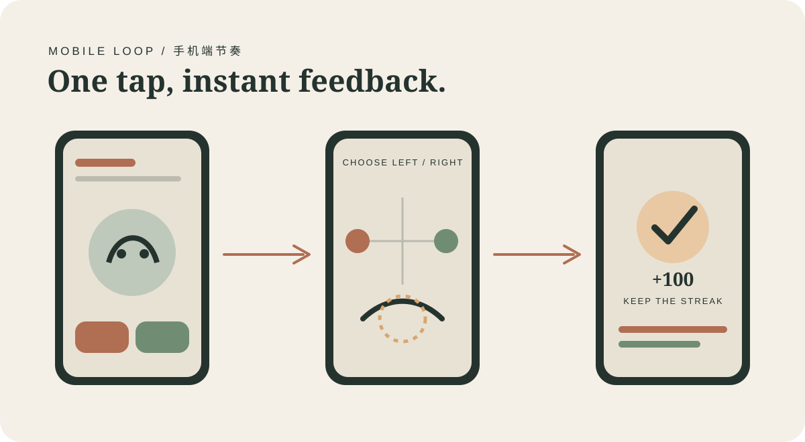

# ⚡ Beat Jev · 打败 Jev

> 一次点击，一次读心。你能把 Jev 甩开多久？ 🐈‍⬛🎯

[](https://github.com/FBddcz/Beat-Jev)
[](https://nodejs.org/)
[](./LICENSE)
[](./docs/platform-publishing.md)



**Beat Jev** 是一个手机优先的无限轻决策对战游戏：每回合只点左或右，Jev 先锁定方向，你要躲开它的判断；角色每五回合切换一次，连胜、音效和反馈会一直把节奏推下去。🌿

## 🎮 现在就玩

```bash
npm install
npm start
```

打开 <http://127.0.0.1:8791/>。不填 Key 时，界面会明确显示**本地练习模式**；连接自己的 Jev API 后，再切换到 **Jev 对战**。Key 只保存在当前服务会话的内存中。



## ✨ 玩法亮点

| 模块 | 体验 |
| --- | --- |
| ⚡ 无限回合 | 不设十回合上限，想点多久就点多久 |
| 🧠 Human vs Jev | 练习模式用本地机器人；Jev 模式调用你配置的模型 |
| 🎬 场景节奏 | 十个轻场景循环，场景负责心情，左右概率保持公平 |
| 🔊 触感反馈 | 音效默认开启，支持关闭；移动端支持轻震和 PWA 主屏幕 |
| 🧾 战绩可带走 | 最近轨迹、连胜和比分可保存为 SVG 战绩卡 |

## 🔌 连接自己的 Jev

点击右上角 **连接 Jev**，填写 API Key 和模型名，先点 **测试连接**，通过后保存。也可以在部署平台配置服务端默认值：

```bash
TYPESAFE_API_KEY=你的服务端 Key
JEV_MODEL=jev-latest
HOST=0.0.0.0
ALLOWED_HOSTS=your-domain.example
```

Key 不会写入前端静态文件；生产环境请使用 HTTPS，并把 `ALLOWED_HOSTS` 限制为实际域名。

## 🧪 开发与检查

```bash
npm test
npm run check
```

## 🗺️ 项目路线

- [x] 手机优先 H5 / PWA
- [x] 无限回合、连胜、音效、震动和战绩卡
- [x] 本地练习模式 + 自填 Jev API
- [x] Render / Docker 自部署模板
- [ ] Cocos Canvas 适配微信、抖音小游戏
- [ ] 在线排行榜和分享房间

## 📄 License

MIT。详见 [`LICENSE`](./LICENSE)。游戏只用于娱乐，不涉及真实金钱或投资建议。
